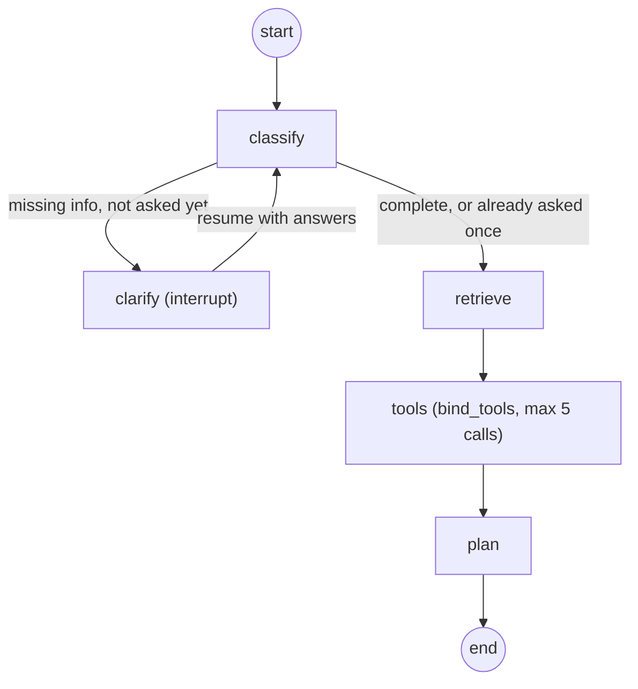

# SecureOps Copilot

[](https://github.com/misialyna/secureops-copilot/actions/workflows/ci.yml)

AI agent supporting security incident analysis: classifies incoming reports, retrieves procedural
knowledge with citations (RAG), asks clarifying questions when information is missing, plans
diagnostics, and uses read-only tools (log analysis, PCAP, MITRE ATT&CK). It pauses before any
action requiring human approval and generates a final report.

## Development

- Tests (fast, what CI runs): `uv run pytest -m "not slow"`
- Tests (everything, including the RAG integration test — requires a built index, see below): `uv run pytest`
- Lint: `uv run ruff check .` (fix: `uv run ruff check --fix .`)
- Dev server: `uv run uvicorn app.main:app --reload --app-dir backend`

## Knowledge base

The RAG knowledge base is built from two public U.S. government incident-response documents,
listed in [`backend/app/rag/sources.py`](backend/app/rag/sources.py):

- NIST SP 800-61 Rev. 3 — *Incident Response Recommendations and Considerations for
  Cybersecurity Risk Management*
- CISA — *Federal Government Cybersecurity Incident and Vulnerability Response Playbooks*

Both are public-domain U.S. government works, downloaded directly from `nvlpubs.nist.gov` and
`cisa.gov`.

### Build the index

```bash
uv run python -m app.rag.ingest
```

This downloads the source PDFs into `knowledge/raw/` (skipped if already present), splits them
into chunks, embeds them with `BAAI/bge-m3`, and stores everything in a local Qdrant index at
`data/qdrant/` (no server required). Neither directory is committed to git — regenerate them
with this command. The first run also downloads the embedding model from Hugging Face
(a few GB), so it takes a few minutes; later runs are fast since both the PDFs and the model
are cached.

### Search

With the index built, either query it directly in Python:

```python
from app.rag.retriever import KnowledgeRetriever

results = KnowledgeRetriever().search("ransomware containment steps", top_k=5)
```

or start the dev server and hit the temporary `/search` endpoint in the browser, e.g.
`http://localhost:8000/search?q=ransomware+containment+steps&top_k=5` (also works with
non-English queries, e.g. `kroki+powstrzymania+ransomware`, since bge-m3 is a multilingual model).

## Agent graph

The core agent is a [LangGraph](https://langchain-ai.github.io/langgraph/) state machine
(`backend/app/graph/`) that classifies an incident report, asks at most one round of clarifying
questions if key details are missing, retrieves relevant procedure excerpts, decides which
read-only investigation tools to run against any uploaded evidence, and produces a diagnostic
plan grounded in both the procedure excerpts and the tools' findings. Classification, tool
selection, and planning all use Groq (`llama-3.3-70b-versatile`), with a small retry (3 attempts,
short backoff) around the structured-output calls in `classify`/`plan` for the occasional
malformed-JSON `tool_use_failed` response. The human-approval gate for *active* (non-read-only)
tools is a placeholder for now (see "Agent tools" below) and lands in a later stage.



Each run is a `thread_id`, persisted via a `SqliteSaver`/`AsyncSqliteSaver` checkpoint at
`data/checkpoints.sqlite` (gitignored, like the knowledge-base index). Because the state is
checkpointed to disk after every node — not kept only in memory — a paused (interrupted) thread
survives a full server restart: resuming with the same `thread_id` after restarting `uvicorn`
picks up exactly where it left off.

Requires `GROQ_API_KEY` set in `.env` (see `.env.example`) and the knowledge-base index already
built (see above).

## Agent tools

Evidence files uploaded for an incident (`POST /incidents/{thread_id}/evidence`) are analyzed by
the `tools` graph node, which lets an LLM decide which of the tools below to run and on which
file. All tools in this stage are `read_only`; an `active` tool (remediation/containment) would
require the human-approval gate, which is not implemented yet — attempting to run one raises
`NotImplementedError` as an explicit placeholder rather than silently executing.

| Tool | `risk_level` | What it does |
| --- | --- | --- |
| `log_analyzer` | `read_only` | Auto-detects auth.log/syslog vs. web access log. auth.log: SSH brute force (≥10 failed logins from one IP in 5 min), successful logins from a brute-forcing IP, new accounts/sudo grants. Access log: top IPs, 4xx/5xx per IP, path-scanning, suspicious user agents. |
| `pcap_analyzer` | `read_only` | Offline PCAP analysis (scapy `rdpcap`, 50 MB file limit): packet count/time range, top talker IP pairs, top destination ports, port-scan detection, suspected C2 beaconing (regular-interval connections to one external IP), suspicious DNS queries (long/repeated domains). |
| `attack_lookup` | `read_only` | Looks up a MITRE ATT&CK technique by ID (e.g. `T1110`) or keyword — name, tactic(s), a short description, and known log/data sources for detecting it. Parsed lazily from the `enterprise-attack.json` STIX bundle and cached in memory. |

Findings that reach an LLM prompt (e.g. sample log lines, queried domains) are always wrapped in
`<untrusted_evidence_data>...</untrusted_evidence_data>` tags in the `plan` prompt, with an
explicit system instruction to treat that content strictly as data — never as instructions —
since it may have been crafted by an attacker (prompt-injection defense).

### Full cycle example

Start the dev server, then:

```bash
# 1. Submit an incomplete incident report
curl -s -X POST localhost:8000/incidents \
  -H "Content-Type: application/json" \
  -d '{"description": "Found repeated SSH login failures on our web server"}' | python3 -m json.tool
# -> {"thread_id": "...", "status": "awaiting_clarification",
#     "pending_questions": ["Which systems/hosts are affected?", ...]}

# 2. Upload the auth.log evidence for this incident
curl -s -X POST localhost:8000/incidents/<thread_id>/evidence \
  -F "file=@auth.log" | python3 -m json.tool
# -> {"thread_id": "...", "filename": "auth.log", "size_bytes": ...}

# List evidence uploaded so far for this incident
curl -s localhost:8000/incidents/<thread_id>/evidence | python3 -m json.tool

# 3. Answer the clarifying questions (echo the exact question strings back as keys) —
#    this resumes the graph, which now runs the tools node against auth.log before planning
curl -s -X POST localhost:8000/incidents/<thread_id>/resume \
  -H "Content-Type: application/json" \
  -d '{"answers": {"Which systems/hosts are affected?": "web01"}}' | python3 -m json.tool
# -> {"thread_id": "...", "status": "completed", "classification": {...},
#     "tool_results": [{"tool_name": "log_analyzer", "findings": [...]}],
#     "plan": {"steps": [...]}, "sources": [...]}

# 4. Re-check the result at any time (e.g. after restarting the server)
curl -s localhost:8000/incidents/<thread_id> | python3 -m json.tool
```

A complete report (no missing information) skips straight from `classify` to `retrieve`/`tools`
and returns `status: "completed"` on the very first `POST /incidents` call. If no evidence was
uploaded, the `tools` node runs no tool calls and `tool_results` comes back empty.
