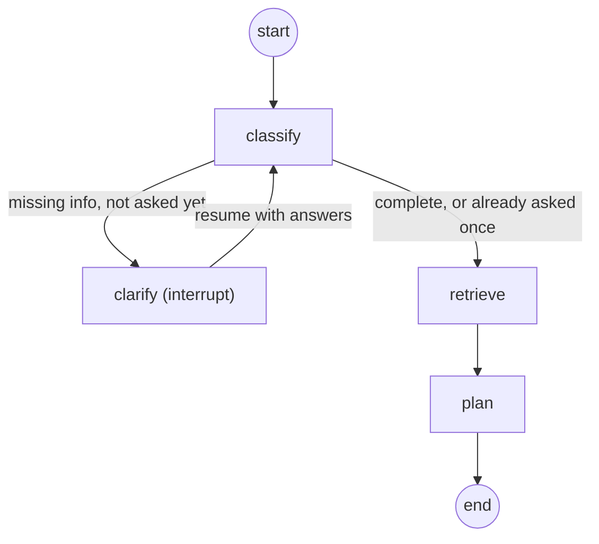

# SecureOps Copilot

[](https://github.com/misialyna/secureops-copilot/actions/workflows/ci.yml)

AI agent supporting security incident analysis: classifies incoming reports, retrieves procedural
knowledge with citations (RAG), asks clarifying questions when information is missing, plans
diagnostics, and uses read-only tools (log analysis, PCAP, MITRE ATT&CK). It pauses before any
action requiring human approval and generates a final report.

## Development

- Tests (fast, what CI runs): `uv run pytest -m "not slow"`
- Tests (everything, including the RAG integration test — requires a built index, see below): `uv run pytest`
- Lint: `uv run ruff check .` (fix: `uv run ruff check --fix .`)
- Dev server: `uv run uvicorn app.main:app --reload --app-dir backend`

## Knowledge base

The RAG knowledge base is built from two public U.S. government incident-response documents,
listed in [`backend/app/rag/sources.py`](backend/app/rag/sources.py):

- NIST SP 800-61 Rev. 3 — *Incident Response Recommendations and Considerations for
  Cybersecurity Risk Management*
- CISA — *Federal Government Cybersecurity Incident and Vulnerability Response Playbooks*

Both are public-domain U.S. government works, downloaded directly from `nvlpubs.nist.gov` and
`cisa.gov`.

### Build the index

```bash
uv run python -m app.rag.ingest
```

This downloads the source PDFs into `knowledge/raw/` (skipped if already present), splits them
into chunks, embeds them with `BAAI/bge-m3`, and stores everything in a local Qdrant index at
`data/qdrant/` (no server required). Neither directory is committed to git — regenerate them
with this command. The first run also downloads the embedding model from Hugging Face
(a few GB), so it takes a few minutes; later runs are fast since both the PDFs and the model
are cached.

### Search

With the index built, either query it directly in Python:

```python
from app.rag.retriever import KnowledgeRetriever

results = KnowledgeRetriever().search("ransomware containment steps", top_k=5)
```

or start the dev server and hit the temporary `/search` endpoint in the browser, e.g.
`http://localhost:8000/search?q=ransomware+containment+steps&top_k=5` (also works with
non-English queries, e.g. `kroki+powstrzymania+ransomware`, since bge-m3 is a multilingual model).

## Agent graph

The core agent is a [LangGraph](https://langchain-ai.github.io/langgraph/) state machine
(`backend/app/graph/`) that classifies an incident report, asks at most one round of clarifying
questions if key details are missing, retrieves relevant procedure excerpts, and produces a
diagnostic plan. Classification and planning use Groq (`llama-3.3-70b-versatile`). Tool calls
(log/PCAP analysis) and the human-approval gate for remediation actions are out of scope for now
and land in later stages.



Each run is a `thread_id`, persisted via a `SqliteSaver`/`AsyncSqliteSaver` checkpoint at
`data/checkpoints.sqlite` (gitignored, like the knowledge-base index). Because the state is
checkpointed to disk after every node — not kept only in memory — a paused (interrupted) thread
survives a full server restart: resuming with the same `thread_id` after restarting `uvicorn`
picks up exactly where it left off.

Requires `GROQ_API_KEY` set in `.env` (see `.env.example`) and the knowledge-base index already
built (see above).

### Full cycle example

Start the dev server, then:

```bash
# 1. Submit an incomplete incident report
curl -s -X POST localhost:8000/incidents \
  -H "Content-Type: application/json" \
  -d '{"description": "Found a ransom note on a shared drive"}' | python3 -m json.tool
# -> {"thread_id": "...", "status": "awaiting_clarification",
#     "pending_questions": ["Which systems/hosts are affected?", ...]}

# 2. Answer the questions (echo the exact question strings back as keys)
curl -s -X POST localhost:8000/incidents/<thread_id>/resume \
  -H "Content-Type: application/json" \
  -d '{"answers": {"Which systems/hosts are affected?": "file-server-01"}}' | python3 -m json.tool
# -> {"thread_id": "...", "status": "completed",
#     "classification": {...}, "plan": {"steps": [...]}, "sources": [...]}

# 3. Re-check the result at any time (e.g. after restarting the server)
curl -s localhost:8000/incidents/<thread_id> | python3 -m json.tool
```

A complete report (no missing information) skips straight from `classify` to `retrieve` and
returns `status: "completed"` on the very first `POST /incidents` call.
